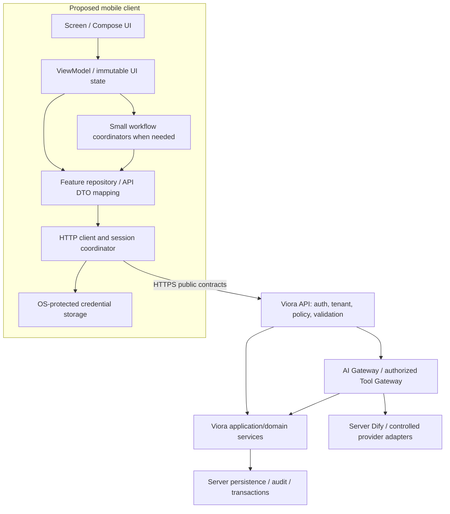

# Mobile architecture

> **Historical proposal snapshot (2026-09-08).** This document records a proposed architecture before the Android foundation was created. Current implementation evidence is maintained in the root `docs/` set; this proposal remains a target/design record.

Status: **PROPOSED**. Final framework is **ARCHITECTURE DECISION REQUIRED**; Kotlin/Compose is the conditional Android-first default in [ADR-M01](MOBILE-ARCHITECTURE-DECISIONS.md). No mobile architecture is approved or implemented by this batch.

## Boundary

The diagram expresses responsibility, not deployed topology. The actual reference contains incomplete handlers and services, as audited in [README](MOBILE-README.md). Mobile has no database, Dify, LLM, embedding, repository-port or server-secret dependency. Standard external OIDC login is the sole separately approved identity-provider interaction; it is not an AI-provider exception.

## Proposed components

Use one Android application module initially, with feature packages, rather than mirroring 51 Nx projects. These are logical responsibilities, not necessarily Gradle modules.

| Component | Responsibility | Must not own |
|---|---|---|
| `app/navigation` | Session/context gate, destination identifiers, Back behavior, safe deep-link validation | Permission grants, PHI route payloads, arbitrary state transitions |
| `core/session` | One session/tenant generation, refresh coordination, local credential lifecycle, protected-request eligibility | Credential verification claims or role policy fabricated on device |
| `core/network` | Approved base URL, TLS, request IDs, bearer attachment, error parsing, timeouts, header preservation | Global write retries, raw request/response logging, tenant-header invention |
| `core/security` | Reviewed OS storage adapter, privacy lifecycle and backup restrictions | Server provider/signing credentials or clinical storage policy decisions |
| `core/model` | Only genuinely shared client values: opaque IDs, safe error categories, date/time types | Duplicated patient/clinical business rules or a universal enterprise entity model |
| Feature UI/ViewModel | Render allowed fields/actions, input feedback, screen state and user intents | Direct network calls in rendering, authoritative permission/lifecycle enforcement |
| Feature repository | Wrap relevant public operations, map DTOs, scope response/state to session and resource, carry ETag/idempotency metadata | Server repositories, SQL, clinical mutation policy or provider integration |
| Focused workflow coordinators | Session restoration; appointment submission/reconciliation; AI review/approval sequence where multiple operations must be coordinated | Cross-domain backend transactions or automatic clinical promotion |

Features: auth/clinic/account, patient, doctor, appointment, clinical and assistant. Repositories are API-facing client adapters, not the backend's persistence repositories. Add a separate use case only where shared orchestration reduces mistakes. Use constructor injection; manual composition is the initial proposal, with a DI framework deferred until justified.

## Dependency direction and contracts

UI depends on state/intents. ViewModels depend on client repositories or focused coordinators. Repositories depend on typed API operations and session context. Shared core does not import feature UI. Feature-to-feature navigation passes identifiers, not private objects; backend public APIs coordinate related resources.

Public wire DTOs map explicitly into client display models. Do not import backend `RequestContext`, database `bigint` versions, provider responses or Node libraries into the app. Backend actor/tenant factories require trusted inputs that a mobile request cannot assert. Treat ETags as opaque strings; do not compute a new version on device. The backend's `current_version` history reference and a concurrency ETag are different concerns.

## State and lifecycle

PROPOSED Android approach: immutable per-screen UI state exposed by ViewModels through StateFlow, lifecycle-aware observation, coroutines for cancellable I/O and unidirectional user intents. This follows the small UI/data separation described by [Android architecture guidance](https://developer.android.com/topic/architecture/recommendations); exact library/toolchain versions remain ADR-M16.

Screen states include Initial/Loading, Content, Empty, ValidationError, Unavailable, PermissionDenied and OutcomeUnknown as appropriate. These are client labels only. Domain statuses retain exact backend spellings.

Every response carries the initiating session generation, tenant and resource scope in client request metadata. Reject results from a prior tenant/account even if cancellation was too late. A voluntary switch/logout clears navigation and all sensitive state; a forced revocation clears immediately. Navigation arguments and saved instance state contain no PHI, prompt, clinical note or credential. Process death loses unsaved sensitive input; state restoration reauthenticates and refetches. Explain unsaved input loss in the UX.

No durable PHI database or write outbox is proposed. Ephemeral already-rendered content may remain during a foreground connectivity interruption only while the session/context remains valid; mark it stale and disable authoritative actions. Cold-start/offline restoration does not unlock protected data. Exact idle/background lock timing is ADR-M15; privacy cover applies immediately when backgrounding sensitive screens.

## Networking and serialization

Use a single reviewed HTTP stack and JSON serializer selected after ADR-M01/G01; do not choose dependency versions or create code now. The adapter must support cancellation, bounded timeouts, explicit null/absence handling, safe error decoding, `X-Request-ID`, strong ETag/If-Match and idempotency headers. Separate ordinary requests from long AI requests by configured timeouts once the backend contract supplies bounds.

The server's snake_case public contract and camelCase handler outputs must be reconciled before DTO implementation. Unknown statuses render as unsupported and disable lifecycle actions. Unknown optional fields may be ignored for additive compatibility; missing required security/state/context fields fail closed. Date-only birth dates never undergo UTC-zone shifts. Appointment timestamps cross the API in UTC and display with an explicit clinic zone; its source is TBD, not inferred from the device's location.

No automatic mutation retry at the HTTP interceptor. Read retries can be bounded for transient failures with current context; writes require operation-specific policy. After an unknown write outcome, reconcile rather than creating a new intent/key. On 412, fetch current data and renew human confirmation. UI disabling prevents duplicate taps but does not replace server idempotency.

## Navigation and permission presentation

Session gate → clinic resolution → Home with Patients, Appointments, permitted Clinical/Assistant paths and Account. Home shows shortcuts and a bounded agenda, not fabricated aggregate statistics. Patient/encounter context persists visibly within its workflow; an AI conversation never silently changes patient context.

Use the published backend role/permission representation for affordances; it is currently incomplete (G02). Unknown or unavailable permission information disables affected actions. A hidden button is a UX measure; each backend endpoint must independently authorize. Navigation cannot be used to bypass direct URL/resource checks. No public PHI deep links are required for MVP; future links must refetch under the current session and tenant.

## Testing and evolution

Unit/state tests use fakes for session, time and APIs. Contract tests verify published schemas/errors/header behavior. UI tests exercise accessible navigation, process recreation and safety-sensitive confirmation. End-to-end tests use a real test backend for tenant isolation, durable idempotency and approval handoff. Backend tests retain SQL, migration, provider, policy and safety-evaluation responsibility; see [testing](MOBILE-TESTING.md).

Split Gradle modules only when team ownership/build constraints justify it. A second platform can reuse documented contracts, workflows and test scenarios, not server internals or Android ViewModels. New offline storage, push, file capture, analytics or AI autonomy requires an explicit scope/architecture decision. Preserve the backend architecture while adding a client beside its API boundary.
