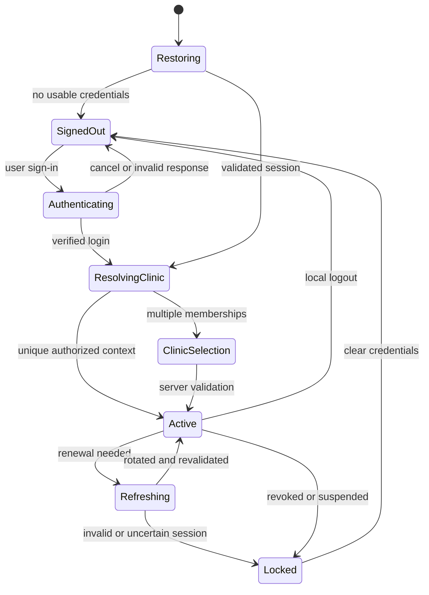

# Mobile authentication and session

Status: **PROPOSED native integration; G02 is blocking.** Existing authentication requirements are R04/R05/R07; current implementation evidence is R09/R18 in [README](MOBILE-README.md). This document does not select a provider account or invent auth endpoints.

## Reference requirements versus current implementation

| Aspect | Existing requirement | Current evidence / gap |
|---|---|---|
| Identity provider | Auth0-style Managed CIAM OIDC/OAuth2 profile behind a provider-neutral application boundary | Subject mapping/resolution exists; no real discovery/JWKS/JWT verifier, provider adapter, callback or token exchange found |
| Credential ownership | Provider owns passwords, MFA, key rotation and standard recovery | Mobile must not introduce local password fields/storage |
| Session | Access token 15 minutes; rotating refresh on every use; absolute refresh session 7 days; replay revokes token family | No refresh/revocation runtime or mobile registration contract |
| Authorization | Application owns roles, membership/tenant, resource policy and revocation | Injected policy interfaces, no complete HTTP composition or permission projection |
| Revocation | Logout, suspension, password/permission change revoke application sessions | Missing end-to-end revocation integration; short expiry is not a substitute |
| MFA | Staff/Admin and privileged clinical operations; explicit step-up for AI approval; recovery exceptions require assurance/authorization/audit | No public assurance evidence or step-up flow; cannot infer an `mfa=true` client flag |
| Identity lifecycle | Current contract: ACTIVE/SUSPENDED/DISABLED; memberships ACTIVE/SUSPENDED/REVOKED | Active-user/membership checks exist; final role wire identifiers/tenant selection transport are not fixed |

I01's documented self-profile differs from its handler: the handler needs exactly one matching active membership and returns actor/membership/tenant. I02 returns only active memberships as a bare array. Resolve response shape, membership ambiguity and client permission display in G02/G01 before implementation. A token's vendor claims do not automatically become clinic permissions.

## Proposed native OIDC flow — NEW MOBILE REQUIREMENT NM02

Use an external browser/system authentication session with Authorization Code + PKCE for a registered public native client, validated redirect handling, state and OIDC nonce validation through a reviewed SDK/adapter. Do not embed a client secret. This recommendation follows [RFC 8252 native-app OAuth guidance](https://www.rfc-editor.org/info/rfc8252/); exact SDK, redirect scheme/app link, issuer, audience, scopes and exchange topology need A/Security approval.

1. S02 starts an authorization request through the approved adapter. Credentials and provider MFA remain in the provider surface.
2. Accept only the registered callback; validate the authorization response and bind it to the initiating session. Cancellation does not partially unlock the app.
3. Exchange the code through the chosen native/provider or backend-mediated topology. The mobile client must not invent a token endpoint or accept arbitrary issuer URLs from deep links.
4. Establish app session material, call I02 and resolve I01/T01 under the agreed contract. No protected feature request precedes valid clinic context.
5. Start a new client session generation. Fetch current permitted data; do not replay old commands.

There are no concrete Viora HTTP contracts for login/callback/refresh/logout/revoke today. Standard OIDC names are capabilities, not guessed `/api/v1/auth/*` routes. Provider discovery identifies provider endpoints; backend owners must publish any application-specific session endpoints. Account creation/onboarding is outside the mobile MVP.

## Proposed session state machine

These are client coordination states, not database status enums:

Offline restoration or unresolved membership does not reach Active. A transient request failure while already active can show feature Unavailable, but privilege-changing operations require current assurance. Session-state checks on device are UX coordination; the server must enforce validity independently.

## Credential handling and refresh

NEW MOBILE REQUIREMENT NM03, proposed: access token in memory; refresh/session secret only in reviewed OS-protected encrypted storage. On Android, Keystore protects cryptographic keys; encrypted app-private storage holds credential bytes. Keystore is not a database for arbitrary refresh-token text. A hardware-backed key may be used where available under the chosen policy, without assuming every device supports it. See [Android Keystore](https://developer.android.com/privacy-and-security/keystore).

Persist only necessary runtime user credentials/session metadata, never provider API keys, OAuth client secrets, backend credentials, build signing keys or PHI. Exclude credential files from backup/device transfer and debug output. If key invalidation, reinstall or corruption prevents safe access, clear unusable material and require fresh authentication; do not downgrade to plaintext.

One session coordinator serializes refresh to prevent parallel rotation/replay. Bind refresh completion to the originating session generation so a late result cannot sign in after logout. Store the replacement refresh credential atomically before exposing the renewed session. A failure between provider rotation and durable replacement may require login; never retry an old refresh token indefinitely. Respect server-issued expiration and revocation; device wall-clock manipulation must not extend access.

401 recovery is bounded and operation-aware. A safe read may resume once after successful recovery if context is unchanged. Clinical finalization, amendments and AI approval return to human review/confirmation; an interceptor must not replay them. 403 is permission denial, not a refresh loop. A fresh token is not proof that clinical need-to-know or tenant membership remained unchanged.

## Tenant and account transitions

Exactly one active membership can be auto-resolved. Multiple valid memberships require S03. A requested tenant filters the server's active membership set; a raw ID never grants access. The current resolver also rejects multiple candidates for the same selected tenant, so ambiguous duplicates require backend resolution rather than arbitrary mobile selection.

Store a last-selected clinic only as a non-authoritative preference; whether even that identifier is persisted is an ADR-M08 privacy choice. Server validation occurs before reuse. Membership list does not currently include clinic names; usable label enrichment must preserve selection authorization without prefetching another clinic's data.

Before switch, logout, account replacement or forced revocation: increment context generation, cancel pending work, clear feature stores/forms/AI context/cursors/ETags and reset Back stack. Discard responses from earlier generations even if network cancellation failed. Idempotency keys are scoped to their original actor/tenant; never reuse one under a new session context for a new operation.

## Step-up and recovery

AI approval needs explicit fresh step-up verified by the backend. Clinical finalization follows the reference privileged-operation MFA policy; exact assurance/freshness representation is TBD. Face/fingerprint unlock of device storage is not automatically provider MFA. Returning from an MFA browser must not trigger approval: refetch reviewed data, compare version, obtain renewed confirmation where changed, then submit the version-bound action.

Standard account recovery stays with the managed provider. Recovery exceptions require application authorization, reauthentication/step-up, bounded scope and immutable audit evidence. Insufficient-assurance sessions cannot invoke privileged operations. Exact challenge-error status, expiry and UI copy require G02; do not overload every 403 as a step-up challenge.

## Logout, expiration and shared devices

Local logout immediately prevents protected display and removes local credentials regardless of connection. Attempt approved application/provider revocation and report whether it was confirmed. Offline logout cannot truthfully promise server revocation; do not retain tokens solely to retry it later. Backend policy must define remote termination/recovery behavior for this case.

Clear sensitive UI/navigation, including in-flight approval state. S02 is the safe destination. Expiration/revocation can interrupt any screen and does not wait for unsaved-form confirmation. Voluntary logout warns about unsaved input without persisting it.

Provider SSO browser cookies may outlive application logout. The selected sign-out/account-switch flow must address shared-device reuse and user intent; do not claim local logout clears the provider browser session. Idle/background reauthentication timing, device biometric convenience and managed-device requirements remain ADR-M15/M16.

Verification requirements: MT01/02/03/04/05/12/13 in [testing](MOBILE-TESTING.md). No login/token/MFA flow was executed in this documentation audit.
