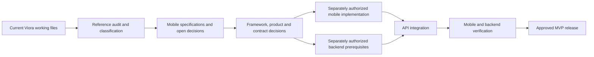

# From current Viora reference to a future mobile MVP

Status: **PROPOSED future sequence. This task stops after documentation audit.** “Migration” means extracting valid reference decisions and adding a mobile client; it does not mean rewriting the backend, moving schema into the app or replacing web architecture documents.

## Dependency sequence

## Phase plan and exit criteria

| Phase | Work | Owner/review responsibility | Exit evidence |
|---|---|---|---|
| 0 — CURRENT Viora audit | Inventory actual working state, docs, domains, contracts, auth/tenant, AI, audit, apps/libraries/tests/web; recheck previous audit claims | This documentation task; reference owners validate findings later | README audit/catalogue, classification A–E, exact source HEAD and working-state caveat |
| 1 — Reference extraction | Preserve entities/statuses/permissions/OCC/idempotency/safety; exclude SQL/Nx/provider/web implementations | Architecture plus A/B/C/D domain owners | Traceability covers every feature; gaps separated from approved requirements |
| 2 — Mobile architecture/specification | Define staff MVP, complete functional screens/flows, framework comparison, session/security, testing/release and decision register | Product/Clinical/Architecture/Security with mobile implementers | These 15 documents; proposed choices clearly labelled. **Current task ends here after validation** |
| 3 — Decision closure | Confirm platform/team/course constraints, launch roles, repository placement, device/locale/zone, native auth, fields, lifecycle and AI handoff | ADR owners in decision register | Written approvals/contract resolutions for affected work; no assumed approvals |
| 4 — Mobile implementation, future task only | Create approved client structure, native session gate, secure credential boundary, navigation and one API read | Mobile implementers; A/API/Security | Working signed debug app with synthetic context and verified same/different-tenant read |
| 5 — Backend prerequisites and API integration, future tasks | Close G01–G10 in domain ownership order; integrate Patient/Doctor/Appointment then Clinical then AI | A identity/tenant/audit/shared; B Patient/Clinical; C Doctor/Appointment; D AI, with affected reviewers | Published wire contracts and real HTTP/persistence/security evidence; safe clinical/AI workflow reachable |
| 6 — Testing/hardening | Run MT and BT matrix, accessibility/device lifecycle, race/idempotency and clinical safety evaluation | Mobile/API/Clinical/Security/AI/Operations | Traceable synthetic results; no waived unauthorized access, stale approval or immutable-record failure |
| 7 — MVP release | Resolve environment, signing, distribution, provider/governance/operational gates; validate final artifact and controlled rollout | Product/Clinical/Security/Operations and release custodian | Approved release evidence per MOBILE-RELEASE; no PHI/secrets in artifact or diagnostics |

## Ordered future implementation slices

1. **Identity and clinic first:** G01/G02 normalized HTTP/auth/context/permission shape, secure restoration and logout, tenant reset, one protected read. No clinical shortcut before this passes.
2. **Patient and doctor:** approved field validation/MRN/status/sex, minimized profiles, search/pagination, doctor/location/shift reads. Core repository ports must have real implementations and audit/policy wiring (G09).
3. **Appointment:** authoritative availability/create/update, explicit confirmation/check-in/cancel commands, OCC/key handling and reconciliation. G03 must make newly created PENDING appointments reachable through the workflow.
4. **Clinical:** history/associations, encounter creation policy, allergy read, initial record, review/finalize and safe correction. Resolve saved-DRAFT editing, mutable-resource OCC and AMENDED continuation before claiming a complete documentation flow.
5. **AI read assistance:** explicit conversation ownership/context, authorized clinical/knowledge loaders, bounded generation, safe classifications, failures and permitted provenance; no direct provider client.
6. **AI drafts and human handoff:** generation semantics, current draft read/edit/resubmit, version-bound review/step-up/approval, durable audit/idempotency and controlled Clinical result/purge. No generic mobile C03 workaround.
7. **Release hardening:** meaningful mobile/backend tests, signed artifact checks, clinical safety gates and unresolved production policy values.

Mobile work against fakes may proceed only with clearly identified draft contracts; it must not hide a missing API behind a permanent fake or label fake behavior as integrated. Exact future task/issue IDs are unassigned. No issue, branch, commit, push or PR is created by this plan.

## Preservation and compatibility

Keep all reference architecture documents and current backend production files intact. Add mobile documents and later client code at the approved location. R23 describes a single monorepo and R08 limits current runtime apps to web/api/workers; that is a backend governance constraint, not evidence that mobile should be a web app. ADR-M17 must decide a separate repository versus an approved additional mobile root before implementation; this task creates documentation in the provided workspace only.

Use reviewed HTTP schema/fixture exchange between owners. Do not copy private TypeScript interfaces as public DTOs, load provider SDKs in mobile, modify migrations for client convenience or reinterpret existing role/status names. Public API evolution requires explicit compatibility decisions; no backend rewrite is implied by this plan.

## Risks and stopping conditions

| Risk / dependency | Consequence | Required response |
|---|---|---|
| No settled platform/team requirement | Wrong toolchain or duplicated platform effort | Close ADR-M01 before scaffolding |
| Documented APIs mistaken for live services | Client built against nonexistent shapes/routes | Close G01 and operation gaps; require real HTTP evidence |
| Missing appointment/clinical navigation and state commands | Workflow cannot reach check-in or reopen/correct records | Resolve G03/G04/G08 rather than changing statuses locally |
| AI approval only changes draft status | False clinical success or unsafe stale approval | G05–G07 block approval release until reviewed-version/MFA/handoff/audit proven |
| No safe recovery for ambiguous commands | Duplicate patient/appointment/clinical operation | Define outcome reconciliation before shipping the affected write |
| Device/shared-session PHI exposure | Wrong-user/clinic display or durable leakage | MT02/04/11/12 and approved privacy/storage policy |
| Unresolved provider/governance/release values or backend boundary failures | No production assurance | Preserve release gates; no implicit waiver from documentation completion |

The completed documentation is reviewable preparation, not production implementation readiness. Resume only on a new implementation instruction and within its approved scope. This task performs no app, API, database or deployment work.
