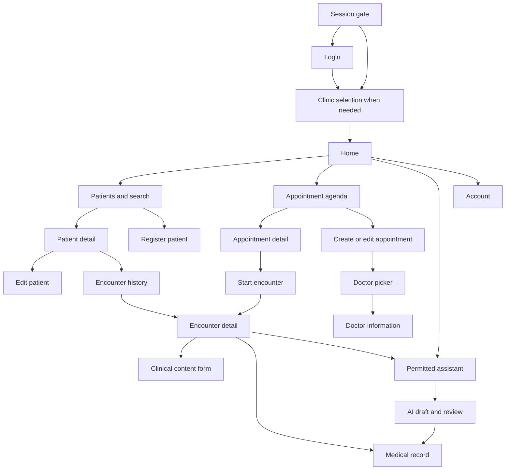

# Mobile screen specification

Status: **PROPOSED functional screen specification; no visual design or design system created.** Existing web content is metadata-only. Screens support the capabilities in [app specification](MOBILE-APP-SPEC.md); they are proposed MVP screens, conditional on the referenced API/decision gaps. Their inclusion does not certify an implemented endpoint.

## Navigation and scope

Single active membership may bypass S03 after backend validation. All protected destinations are behind S01. S21 can return to S03 to switch clinic or S02 to log out. Clinical and Assistant destinations are permission-aware; Receptionist never gets clinical content by following a link. Doctor information is a supporting selection flow, not a separate administrative top-level section.

Back returns within the current context. Successful create/update replaces obsolete form state with refreshed detail. Picker Back discards selection only. Voluntary departure from an unsaved sensitive form prompts discard confirmation; forced session invalidation clears it immediately. Do not place PHI, tokens, full forms or model responses in routes, saved state or notification payloads.

## Screen catalogue

Each row defines purpose, entry, role, data, actions, API dependencies, navigation and sensitive-data behavior. The matching row in the next table defines all loading/empty/error/denied states; both tables together are the complete screen contract. “Authorized” always means server-granted operation and resource access, not role name alone.

| ID / screen / purpose | Entry and user | Data displayed | Actions and API calls | Navigation destinations | Sensitive-data considerations |
|---|---|---|---|---|---|
| S01 Session/loading — establish a safe session and clinic | App launch/resume, forced restoration; any user | Neutral progress and safe connection/session message only | Restore/refresh through G02; I02/I01 and T01 once permitted; retry or local logout | S02, S03 or S04 after validation | No cached patient/AI/clinical content during restoration |
| S02 Login — start managed authentication | S01, logout, expiration; unauthenticated user | Product identity, sign-in action, safe error/recovery link if provider supports it | Launch approved external OIDC/MFA/recovery; G02 callback; no app-owned password fields | S01/context resolution; external provider then app | Never inspect/store passwords; callback/code/token excluded from logs |
| S03 Clinic selection — resolve multiple active memberships | S01 or S21; authenticated member | Authorized membership/clinic labels and status where available; current selection | I02; validate selected context through G02/I01; T01 after context acceptance | S04; S21/S02 if unable to proceed | No cross-tenant patient previews; do not invent names when membership payload has only IDs |
| S04 Home — orient current clinic worker | Valid S01/S03; any supported authorized worker | Clinic name/status, current account context, permitted shortcuts; optional bounded appointment preview | T01, A01 only with scheduling access; open feature | S05, S11, S19, S21 | No clinic-wide counts from a page; no clinical summaries for operational-only users |
| S05 Patient list/search — find a patient | Home/Patients, S13 picker; directory-authorized staff/doctor/admin | Permitted MRN/name/demographics sufficient to distinguish patients; search criteria and continuation | P01 using field allowlist; select; create if permitted | S06, S07 or return selected reference to S13 | Search values/results stay in current-session memory; no analytics capture or cross-tenant matching |
| S06 Patient detail — verify profile and enter workflows | S05/S07/S08 or authorized reference; patient-read actor | P03-minimized demographics/contact; clinical links only when authorized; no inferred absent values | P03; edit, patient appointments via A01, history, start encounter/assistant when authorized | S08, S11, S14, S16, S19; Back S05 | Operational profile permission does not expose notes/allergies automatically |
| S07 Register patient — create tenant-scoped profile | S05; actor with create permission | Form: MRN, name, DOB, sex, phone/email/address/emergency contact/status as approved; visible clinic | P02, one key per confirmed intent; field validation, submit/cancel | S06 on verified creation; S05 on cancel | `user_id` association only if separately designed; unresolved value sets/optionality block final form. No fabricated defaults |
| S08 Edit patient — change permitted demographics | S06; field-specific update actor | Allowed editable P04 fields and current profile; retain associated ETag internally | P04 with `If-Match`; P03 refresh on conflict; save/discard | S06 | No MRN/tenant/user identity/clinical mass assignment; no PHI in saved instance state |
| S09 Doctor list/picker — select provider | S13 or supporting doctor access; scheduling/profile actor | D01-minimized display name/specialization/status and approved location labels | D01 search/filter/paginate; select or inspect | S10 or return doctor reference to S13 | No ratings; no unnecessary user/license identifiers |
| S10 Doctor information — inspect permitted profile/shifts | S09/S12 authorized doctor reference; profile/schedule actor | D02 profile, D03 shifts if permitted, location and explicit interval zone | D02/D03; choose provider; return | S13 or S09/S12 | License fields only if backend permits; no department-name guessing or shift administration |
| S11 Appointment agenda — daily/range operational view | Home, S06 patient filter; permitted scheduling actor | Bounded A01 appointments, explicit time zone/status; derived CHECKED_IN/IN_PROGRESS queue view | A01 filter/load more; open or create | S12/S13; S06 for authorized patient | Notes/reason only where needed; partial results are labelled, never complete queue totals |
| S12 Appointment detail — review/act on appointment | S11/S13; resource-authorized actor | A03 scheduling data/status/authorized patient and doctor labels; current clinic | A03; A04 via S13; A05 cancel; A06 check-in; G03 confirmation; G04 encounter discovery | S13, S10, S06, S15 or S16 as authorized | Explicit patient/time confirmation before mutation; no generic status selector; no manual NO_SHOW until defined |
| S13 Appointment create/edit — schedule an interval | S11/S12/S06; create/update actor | Patient/doctor/location selection, start/end, reason/notes; availability status | P01/D01/D03/T02/A07 supporting reads; A02 create or A04 edit with required key/ETag | S05/S09 pickers; S12 on success; back on cancel | Client does not reserve slots; IDs/context revalidated server-side; show clinic time zone |
| S14 Encounter history — find authorized clinical work | S06; clinical-read actor | G04 bounded encounter summaries: references, doctor, times, status; record association when authorized | G04 patient history/association reads; open encounter; start if permitted | S15/S16; S06 | Missing service blocks data; never infer absence of previous care |
| S15 Encounter detail — current clinical context | S14/S16/S12 via G04; treating/authorized clinical actor | C02 patient/doctor/appointment refs, started/ended/status; C08 allergy panel, G04 record association | C02/C08/G04; create/view record, request AI; lifecycle commands only after ADR-M13/G03 | S17/S18/S19; clinical context Back | Allergy unavailable versus no records clearly distinct; no prescription/lab/file actions |
| S16 Start encounter — validate clinical references | S06/S12/S14; encounter-create doctor/authorized clinical staff | Patient, doctor, optional authorized appointment, permitted start time; clinic | C01 with key; reference confirmation; cancellation | S15 on 201; origin on cancel | Do not select arbitrary status or impersonate creator; walk-in support needs Product confirmation |
| S17 Clinical content form — initial note or amendment | S15 initial; S18 amendment; documentation/amendment-authorized clinical actor | Four content fields; existing finalized content read-only alongside correction when permitted; amendment reason mandatory | C03 initial or C07 amendment; explicit save/discard; current ETag for amendment after G08 | S18 on success; origin on cancel | No automatic diagnosis/treatment values; saved-DRAFT editing is G08, not a second record. No persistent autosave PHI |
| S18 Medical record view/review — inspect authoritative record | S15/S17 or verified AI handoff; authorized clinical actor | C04 metadata, current version content, lifecycle state/author/time; version selection only if contract defined | C04 read; C05 review; C06 explicit finalize with assurance; C07 via S17; refresh | S17 amendment, S15; approved source links when provided | Finalized content immutable; no general Edit button; AMENDED follow-up blocked until defined |
| S19 AI assistant — contextual advisory help | S04 for permitted nonclinical help; S06/S15 clinical; AI-authorized actor | Explicit clinic/patient/encounter context; authorized conversation, validated messages, limitations/sources | AI01/AI02/AI03; request AI04; K01 may run server-side; user retry after safe failure | S20 or return to originating context | No provider/model configuration, raw context dump, files, voice or tool picker; render output as untrusted |
| S20 AI draft display/review/approval — human gate | AI04 result/authorized known draft reference; human reviewer/approver | G05 current draft, GENERATED/REVIEWING/etc., exact content, provenance/sources if supplied, patient/encounter, safe version binding | G05 refetch/edit/resubmit only after defined; AI05 review; AI07 reject; step-up G02 then AI06 explicit approval | S18 only using verified clinical handoff; S19/origin otherwise | Persistent draft-only/advisory label before clinical handoff; no automatic approval on view; purge content after backend policy |
| S21 Account/session — current user, clinic and logout | Home or any safe account entry; signed-in user incl. blocked membership | I01-permitted identity/status, T01 clinic, safe session state; no raw credentials | I01/T01 refresh; clinic switch; local clear and G02 logout/revoke | S03/S02; safe Back | No secrets or raw claims; offline logout distinguishes local completion from remote revocation |

## Required states for every screen

Global error handling applies to every protected screen: 401 locks or coordinates eligible session recovery; 403 disables/removes affected data/actions; 404 gives a non-disclosing unavailable resource; 412 forces refetch/review; no raw backend exception is shown. Loading never retains another session's content. Empty means a successful, authorized empty result only.

| Screen | Loading | Empty | Error / failure | Permission denied |
|---|---|---|---|---|
| S01 | Neutral restoration progress; one refresh in flight | No stored session → S02 | Offline/refresh uncertainty stays locked, retry/logout | Revoked identity locks; no membership → access-unavailable S03/S21 |
| S02 | Disable duplicate sign-in during handoff | Initial signed-out prompt | Cancel returns to prompt; invalid callback safe error; no credential detail | Suspended/recovery-only account cannot enter protected app |
| S03 | Membership fetch/selection validation; no tenant data | No active memberships: access unavailable and logout | Failed list/context switch offers retry; no automatic alternate tenant | Reject unapproved membership; clear old clinic content |
| S04 | Clinic shell; independent agenda loading | No permitted upcoming appointments/shortcuts as applicable, not zero clinic patients | Failed preview labelled unavailable; rest remains usable if authorized | Hide unauthorized feature; invalid context returns gate |
| S05 | Search progress, preserve current text in memory; cancel prior query | No matches with authorized create action if allowed | Search/network/rate-limit/cursor error, explicit retry | No directory access; clear results, no inferred patient existence |
| S06 | Detail placeholder without previous patient content | Not applicable to resource; absent optional field means not supplied | Missing patient or failed refresh → unavailable, no stale edit | Clear inaccessible fields/resource; remove clinical navigation without access |
| S07 | Submitting disables second create | Blank initial form, no assumed enum values | Field errors; 409 explicit resolution; uncertain submission reconciled | Disable submit/clear on lost session or tenant; no create grant from UI |
| S08 | Load current profile; saving state | Not applicable; no allowed editable fields explains unavailable action | Validation or stale profile: refetch/compare; never silent overwrite | Cannot edit; return to permitted read view or clear resource |
| S09 | Doctor query/pagination progress | No authorized matching doctors | Failed lookup/invalid filter does not imply no providers | Denied directory hides list and selection |
| S10 | Profile and shifts load independently | Successful empty shifts means no listed shifts in range | Profile unavailable; failed shifts labelled unavailable | Minimize profile; schedule section denied separately |
| S11 | Agenda/next-page loading in selected range | No appointments in successful query/range | Network/cursor error; incomplete pages labelled | Clear denied appointment data; remove create/queue controls |
| S12 | Detail/command progress | Not applicable | Missing appointment, conflict, stale state or outcome unknown; refresh/reconcile | Clear/disable operation based on response; no escalation by role assumption |
| S13 | Supporting choices/availability loading; submit progress | No providers/locations/available intervals: cannot submit | Invalid times/fields, 409 collision, 412 stale edit, network ambiguity | Disable create/edit or unavailable picker; no alternate tenant fallback |
| S14 | History request/load-more | Successful empty history only | G04 missing or failed → history unavailable, not no encounters | Do not display clinical history or details |
| S15 | Encounter, allergy and record association loading | No associated medical record after successful lookup → authorized create; empty allergy collection labelled carefully | Association/allergy service unavailable separately; do not create duplicate record on lookup failure | Clear clinical data and actions; return to safe patient/profile surface if permitted |
| S16 | Reference validation/submission | No valid patient/doctor selection → prompt, no default | Duplicate/mismatched reference or unknown submission outcome requires resolution | Encounter create unavailable; no substitute actor |
| S17 | Initial/current amendment context load; explicit save progress | Blank initial content; no manufactured “none” values | Field validation, stale amendment, undefined edit lifecycle or unknown save outcome stops submission | Disable save immediately; clear protected content on session invalidation |
| S18 | Record/version fetch or command | Not applicable; missing version is unavailable data | 409/412, missing version, invalid lifecycle, assurance failure; no generic edit workaround | Read/finalize/amend separately denied; AI cannot supply permission |
| S19 | Sending/processing indication; no authoritative result yet | New conversation prompt; successful empty retrieval distinguished from retrieval failure | Safe deferral/timeout/provider/tool/malformed output; no unsafe partial text or fake completion | Deny assistant or specific context/tool; preserve only permitted manual navigation |
| S20 | Exact draft fetch/review/approval step; disable duplicate action | Purged/expired/missing content → unavailable for review, not blank approvable draft | 412 returns to review; timeout is outcome unknown; absent handoff no clinical-success claim | Read/review/approve permissions distinct; insufficient step-up stops approval |
| S21 | Safe profile/session refresh and revocation progress | Permitted optional profile fields absent; no membership offers logout | Offline profile unavailable; logout clears locally even if revocation unconfirmed | Blocked account/membership still has local logout; never shows protected clinical fields |

## Forms, lists, details and confirmations

Form labels must state required/optional according to the approved wire schema. Patient DOB uses date-only entry; appointment times display the approved clinic zone and send UTC. Do not assume locale from developer machine settings. Allow accessible keyboard type/focus, visible labels, field-specific errors and a safe top-level error summary. Unknown allowed values are a contract blocker, not an invitation to invent a picker.

List results are paginated with stable resource identity. Search input and delayed results are scoped to the current query, actor and tenant. Do not prefetch clinical detail for every list row. Detail screens refetch on safe entry when freshness is required and retain their server ETag internally. Omitted fields are not inferred as negative medical findings.

Confirmation surfaces are parts of their owning screens, not extra domain states: discard unsaved input; cancel appointment; reschedule changed interval; finalize clinical content; approve/reject AI draft; voluntary clinic switch/logout. Approval/finalization confirmation includes the current patient/encounter and actual reviewed content context. It is never triggered by a navigation event or lifecycle restoration. 412 always invalidates the previous confirmation.

## Mobile accessibility and adaptive layout

NEW MOBILE REQUIREMENT NM05: use accessible semantic labels/roles, logical reading and focus order, screen-reader announcements for loading/errors, visible error text and non-color status indicators. Support large text, contrast, keyboard/assistive input and system insets without hiding submit/confirmation controls. Under the proposed Android default, interactive targets should be at least 48×48 dp, consistent with [Android accessibility guidance](https://developer.android.com/guide/topics/ui/accessibility/apps). Validate on actual supported devices; minimum SDK and device sizes remain ADR-M16.

Use a single-column task layout on narrow screens; wider layouts may pair list/detail without altering authorization or confirmation steps. No orientation lock is assumed. Preserve screen-scoped state through configuration changes only in memory; process death loses sensitive unsaved input. Long clinical content must scroll without obscuring the draft/advisory state or explicit confirmation context.

NM06 privacy applies to all PHI screens: cover app-switcher previews, implement the approved screenshot policy, exclude sensitive content from logs/analytics/backup/saved-state routes and avoid automatic clipboard/export. This is a functional specification; colors, typography, icons, branding and visual assets remain unselected because no reusable design specification was found.

## Investigated but not separate MVP screens

No dedicated logout/expiration page beyond S01/S02/S21; no independent clinical dashboard totals, full month calendar, audit browser, staff administration, patient portal, knowledge administration, notifications inbox or push settings. AI draft display, review, rejection and approval are S20 states/actions, not separate stores of clinical truth. Clinical draft editing after save, AMENDED progression and AI edit/resubmit remain required contract decisions, not invisible shortcuts.
