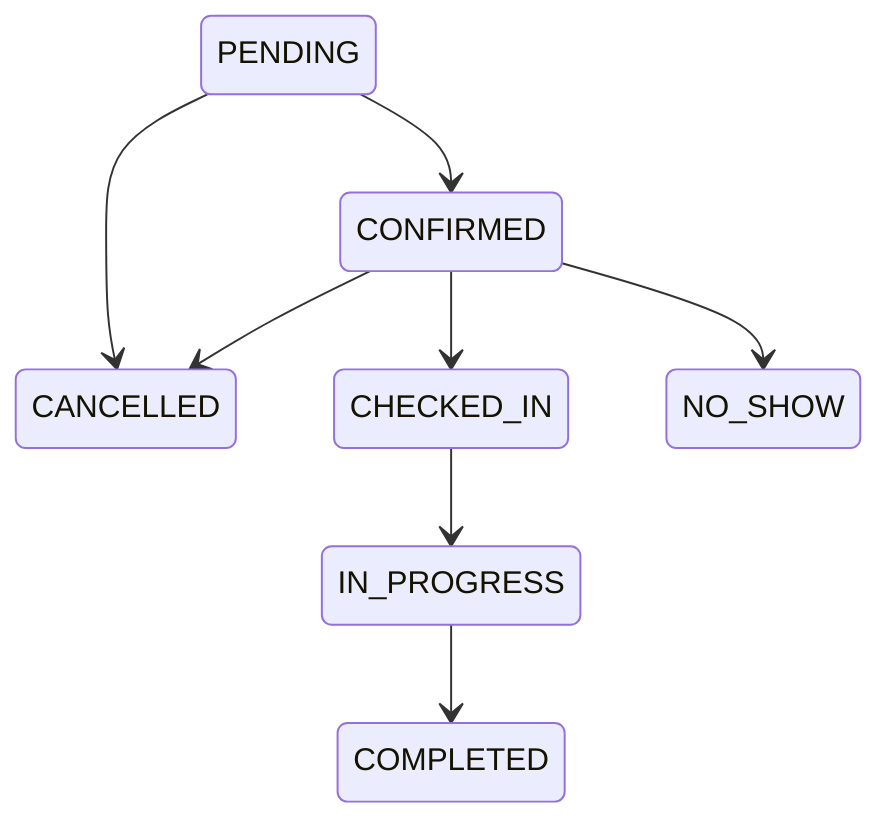
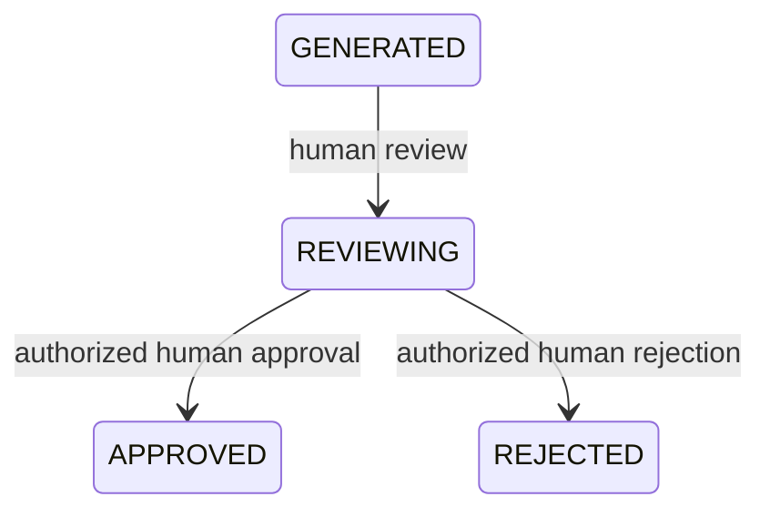

# Mobile user flows

Status: **PROPOSED mobile flows over reference domain rules**. Screen IDs are defined in [screen specification](MOBILE-SCREEN-SPEC.md); operation/gap IDs in [API integration](MOBILE-API-INTEGRATION.md). UI states such as Loading and Outcome unknown are presentation states, never new persisted domain statuses.

## U01 — Login

1. Launch S01; with no restorable credentials, route to S02.
2. User starts external OIDC login; provider handles credentials, MFA and standard recovery. Validate the native callback under the approved G02 contract.
3. Establish the short-lived access token/rotating refresh session; call I02 and resolve the caller via I01 in the agreed order. Current `/me` membership dependency must be reconciled before implementation.
4. With one active membership, validate that clinic; with several, enter S03. With none, remain in an access-unavailable state with account/logout available.
5. Confirm active context via backend, fetch T01, enter S04. No patient request precedes context establishment.

Cancellation returns to S02 without error escalation or a partial session. Invalid issuer/state/nonce/code verification, account suspension or insufficient MFA never unlocks protected content. Failed transport offers retry without claiming invalid credentials. G02 blocks live login; there is no invented Viora login path.

## U02 — Session restoration and refresh

1. S01 reads only secure credential/session material. Do not restore clinical screen payloads from saved state.
2. If refresh is necessary, use a single coordinated rotation request; atomically replace stored credentials only for the still-current session.
3. Revalidate identity, membership and active clinic. A previously selected clinic ID is a preference, not authorization.
4. Reopen only a safe destination after an authorized refetch. If context changed, discard old forms, keys, cursors, content and navigation.

Access lifetime is 15 minutes; refresh lifetime is an absolute 7 days, not sliding permission to remain signed in forever. Invalid/replayed/revoked refresh locks the app and clears credentials. Offline restoration stays locked with retry/logout available. Background time/device clock does not override server expiry. Late responses from an earlier session/tenant are discarded. See SEC01–04.

## U03 — Clinic selection/switching

1. Enter S03 from bootstrap or Account. Show only I02-authorized memberships; do not assume membership payload includes clinic names.
2. On selection, invalidate the current session-context generation before issuing any new tenant query.
3. Backend validates requested membership/tenant through the G02 mechanism; load T01/T02 after context acceptance.
4. Reset to S04 for the new clinic. A location picker stays inside that clinic.

Unsaved current-session input requires a discard confirmation before a voluntary switch. A revocation forces immediate lock/clear without waiting for confirmation. Unknown/expired membership selection is denied; do not fall back to another clinic with an in-flight form. No active membership is an access issue, not an empty clinic dashboard.

## U04 — Patient search

1. S05 opens from Home/Patients or an appointment picker with P01 permission.
2. Select an allowlisted search field; submit bounded text. Do not turn free text into arbitrary filters or log it.
3. Display field-minimized results and opaque paginated continuation. Replacing the search cancels/discards previous results.
4. Confirm patient identity from authorized demographics/MRN, then choose S06 or return its reference to S13.

Zero results permits registration only with create permission. A timeout, 429, denied directory, invalid cursor or malformed response is not zero results. Revalidate tenant on each response. No cross-tenant matching or automatic patient merging.

## U05 — Patient registration

1. From S05, authorized user enters S07; current clinic is visible.
2. Enter known demographic/contact information and an approved MRN/status/sex value. ADR-M12 must define unresolved value sets/optionality before the production form is implemented.
3. Validate required fields locally for feedback; server repeats validation. Generate one opaque idempotency key for this submission intent.
4. Submit P02 once. On 201, navigate to S06 using the returned patient reference and current representation/ETag.

409 duplicate/business conflict needs user resolution; a reused-key/different-payload conflict must not be retried under a silently new key. A lost response leaves outcome unknown; reconcile by approved read/replay. Do not auto-create again after restart. Never supply fake phone/email/clinical data to satisfy current required-string validation.

## U06 — Patient detail/edit

1. Load S06 through P03; show only permitted profile fields. Clinical history/allergies require separate permissions and APIs.
2. An authorized edit action opens S08 with current ETag and allowed demographic fields.
3. User confirms changes; P04 sends those fields and `If-Match`.
4. On success update current view and ETag. Clinical records are not modified by this operation.

On 412, refetch and show that the profile changed; require deliberate reconciliation before a new submission. Do not auto-overwrite. On 403/404 clear the protected resource. A receptionist's missing clinical section means no access, not no history. A suspended tenant cannot perform ordinary updates.

## U07 — Appointment creation, update and check-in

1. S11 displays an agenda from A01 with explicit date/time zone and clinic. Select an appointment for S12, or create in S13.
2. Select patient (S05), doctor (S09/S10), active location (T02) and time interval. D03/A07 provide scheduling context only.
3. Submit A02 with idempotency key; backend validates shift coverage, tenant/reference relationships and atomic scheduling. Success is `PENDING` in current application code.
4. **G03 required:** authorized explicit confirmation moves PENDING to CONFIRMED. The app must not skip this transition or use a made-up confirmation endpoint.
5. At arrival, refresh A03; authorized user confirms A06 with current version/key. Success is CHECKED_IN with `checked_in_at`, reflected in the derived queue.
6. Reschedule via A04 after renewed availability check, ETag and explicit user confirmation; cancel via A05 only from PENDING/CONFIRMED.

409 means resolve business/scheduling conflict; 412 means refetch/reconfirm. A timeout after mutation is outcome unknown. Start/completion coordination with encounters and NO_SHOW action remain G03/ADR-M13; no arbitrary status dropdown. Queue is appointments in CHECKED_IN or IN_PROGRESS, not a separate entity. A loaded partial page is not a complete queue count.

These are the exact domain transitions, not a statement that all public commands exist.

## U08 — Encounter and medical-record workflow

1. An authorized clinical user opens patient history S14 using G04 or a known encounter S15 using C02. Existing appointment→encounter and encounter→record discovery require G04.
2. If starting new work, S16 confirms patient/doctor and optional appointment; C01 returns the encounter. Initial OPEN is observed in tests; complete creation/transition policy is ADR-M13.
3. Read permitted allergies (C08) and relevant history. A failed allergy lookup must say unavailable, never “no known allergies.”
4. S17 initial mode collects diagnosis, symptoms, clinical notes and treatment plan. C03 creates one logical record and its first DRAFT version; do not create a second record to implement editing.
5. S18 reads C04. The clinician requests review C05: DRAFT → IN_REVIEW.
6. After explicit review and required assurance, C06 finalizes the current version: IN_REVIEW → FINALIZED. Refetch authoritative result; preserve immutable prior content.
7. Corrections use S17 amendment mode and C07 with mandatory reason, new content and version binding. The current reference produces AMENDED with a new version.

**G08 blockers:** current saved-DRAFT correction and the next transition after AMENDED are undefined. Do not add AMENDED → IN_REVIEW or repeated amendment transitions without an owner decision. Client OCC/step-up for privileged operations must be implemented server-side. Clinical finalization does not automatically prove encounter or appointment completion; that mapping is G03/ADR-M13.

## U09 — AI assistant and knowledge retrieval

1. S19 opens from a permitted patient/encounter context or a permitted nonclinical clinic context. Show explicit clinic/patient/encounter context; user can verify it before sending.
2. AI01 creates the authorized conversation. AI02 sends bounded user intent and approved references, not a bulk medical record or provider configuration.
3. Backend validates user/context, uses authorized tools and tenant-only knowledge, builds minimum context, invokes its provider adapter and validates/classifies output.
4. Display advisory response/summary, limitations and approved source references returned by the backend. Do not invent sources or clinical facts.
5. Unsafe/high-risk/ambiguous/conflicting outcomes show safe deferral and clinician direction supplied by policy. No automated escalation message is sent without an approved notification workflow.

Current synchronous completion port is evidence, not full orchestration. If a future response is 202, the UI waits only through a documented completion contract; no invented polling. Provider/tool/authorization/timeout errors close the AI path while manual permitted screens remain usable.

## U10 — AI draft generation and review

1. From S15/S19 an authorized clinician requests AI04 with patient/encounter references and an approved draft type.
2. Backend returns a GENERATED draft, or a documented pending result. G06 must safely connect generation and persistence; existing gateway refusal is not a reason to bypass it.
3. S20 loads the exact current draft via G05. Display non-authoritative content, source context, state and safe provenance.
4. Explicit review action AI05 records GENERATED → REVIEWING. Screen opening alone is not proof of completed human review.
5. Human compares all content with authoritative records. Edits/resubmission use G05's future approved contract and new version binding; local edits cannot count as approved server content.
6. Reject through AI07 from REVIEWING or continue to U11. GENERATED cannot be approved directly in current workflow.

EXPIRED, REJECTED and APPROVED are not editable/reapprovable by invented transitions. Expired/purged/missing sources block approval and require a newly authorized workflow. No timeout marks a draft REJECTED or EXPIRED in mobile storage.

## U11 — AI draft approval

1. Authorized human reviews current REVIEWING content and chooses explicit approval in S20.
2. Obtain fresh provider-backed step-up assurance through G02. Device biometrics alone are not backend MFA proof.
3. Re-fetch/revalidate current draft and relevant context through G05. If content/version changed, return to review before renewing confirmation.
4. Submit AI06 with the reviewed `If-Match`, opaque key and approved assurance mechanism. Actor/tenant/approval time are server-derived.
5. Backend repeats authentication, permission, tenant, state, business and reviewed-version checks, records audit provenance, and performs the controlled Clinical handoff once.
6. Show approval success only after the verified response; follow the returned clinical reference to S18 and read its actual state. APPROVED does not imply FINALIZED.

On 412, invalidate prior confirmation and repeat review. On 403/insufficient assurance, stop approval. On timeout/lost response, show outcome unknown and reconcile via approved reads; do not replay approval automatically. No handoff reference means no claim that the medical record was created. Post-approval draft content purge must follow backend governance without losing the authorized clinical result. G07 blocks this entire end-to-end path today.

EXPIRED is a defined status governed by retention; no expiry transition worker is inferred from this diagram. AI draft states are distinct from medical-record DRAFT/IN_REVIEW/FINALIZED/AMENDED.

## U12 — Logout and session expiration

1. Account S21 allows logout; voluntary logout confirms loss of unsaved input.
2. Immediately invalidate session generation, stop protected work, clear navigation/content/forms/cursors and remove local credentials. Attempt server/provider revocation using the approved flow.
3. Return to S02. Report remote revocation separately if offline/unconfirmed; do not retain refresh credentials merely to retry later.
4. An expired/revoked/suspended/insufficient-assurance session can force lock from any screen, including during approval. Late responses cannot restore the old account or tenant.

Fresh login never auto-resumes a previous clinical approval or replays a prior actor's pending command. Provider browser SSO cookies and application logout have distinct lifecycles; the final sign-out/account-switch contract must prevent unintended shared-device reuse without promising browser-session revocation that has not occurred.
